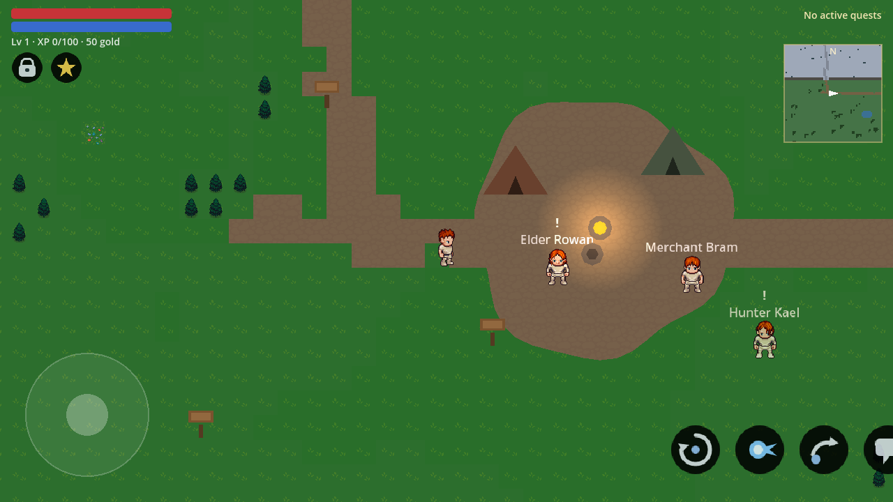

# ⚔️ OpenWorld RPG

A complete, polished **2D open-world action RPG for Android**, built with **Godot 4** — real-time
combat with dodge i-frames, a chunk-streamed seamless world with 3 biomes, talent trees, quests
with branching dialogue, loot, shops, and full save/load. Built to ship: signed APK/AAB from CI.

> 📍 Status: **content-complete and CI-green; nothing ships until a human plays it.** The
> Phase F content build is finished — 120 items across five rarity tiers, 14 monsters placed by
> biome and level, 6 escalating bosses, a 100-step main chain, 100 side quests, 40 secrets and a
> full economy/power balance pass (`tools/balance_report.py`) — and every one of those is guarded
> in CI. What remains is the part nobody can do from a CI runner: **playing it on a real device**
> and profiling it there (see `PLAYTEST.md`, ROADMAP Phase G). See [ROADMAP.md](ROADMAP.md) for
> the current state, [DECISIONS.md](DECISIONS.md) for design decisions, and
> [CREDITS.md](CREDITS.md) for third-party licenses (attribution also ships in the in-game
> credits screen). Signed APK/AAB are produced by the `release` workflow on `v*` tags.



*Real in-engine render (headless CI can't show this — see `tools/art/capture_screenshot.gd`).*

## Quick facts

| | |
|---|---|
| Engine | Godot 4.4.1-stable (GL Compatibility, mobile) |
| Target | Android (ARM64 + ARMv7), 60 FPS on mid-range hardware |
| Design resolution | 1280×720, `canvas_items` stretch, `expand` aspect, landscape |
| Repo budget | < 120 MB total (enforced in CI); toolchain lives in `/tmp/rpg-toolchain/` |
| Content | 120 items / 5 rarities · 14 monsters · 6 bosses · 100-step main chain · 100 side quests · 40 secrets |
| Performance | ~60 FPS target; balance measured in `reports/balance-*.md` (`tools/balance_report.py --check`) |
| Language | English |

## What's in the game

- **World** — 35 authored chunks (Tiled JSON → compiled scenes) across Verdant Meadows,
  Ashen Barrens and Frosthollow Peaks; gated mountain passes, a hidden grove secret,
  5 fast-travel campfires, day/night tint cycle, real terrain minimap.
- **Combat** — directional melee, dodge with i-frames, Whirlwind + Firebolt cooldown
  abilities, telegraphed enemy AI (idle/patrol/chase/attack/flee), the three-phase
  Ember Warden boss, damage numbers, hit-stop, particles and squash-and-stretch.
- **Progression** — XP/levels on a re-tapered 1–100 curve, 3-branch talent tree (60 nodes),
  stats (HP/MP/stamina/ATK/DEF/SPD), loot chests, stacking inventory, equipment affecting
  stats, consumables, shop economy.
- **Loot** — 120 items in five tiers that are a *strict power ordering* (weighted stat budgets:
  12 / 26 / 48 / 78 / 120), every one lootable from monsters, with **lifesteal only ever a
  chance find on rare-or-better gear**. Rarity is colour-coded in the inventory.
- **Monsters & bosses** — 14 types from Slime Grunts to Ashen Heralds, placed by biome and
  level band (nothing spawns outside its band), and 6 bosses escalating from the Goblin King to
  the Ember Warden's unchanged three-phase fight.
- **Story** — 4-part main questline with branching, consequential dialogue, plus a **100-step
  main chain** (MQ001–MQ100, with the Mireille expose/protect fork) and **100 side quests**
  served from a runtime board, all data-driven JSON with level-gated dialogue.
- **Secrets** — 40 of them: buried caches you walk over, carvings that read as lore and point at
  the next one, landmarks with a view, and locked vaults that want a key *and* a level.
- **Meta** — 3 save slots, settings (volume/joystick/language stub), main menu with slot
  picker, pause, death and fast-travel screens, and a credits screen carrying the CC-BY-SA
  attribution that ships with the art and music.
- **Controls** — keyboard or touch: left virtual joystick; right buttons for attack,
  dodge, interact and the two abilities (with live cooldown readouts).

## Repository layout

```
scenes/    Godot scenes (main, player, enemies, ui screens)
scripts/   GDScript: autoloads/, player/, world/, ui/
assets/    game-ready art & audio
  source/  vendored upstream sheets (reproducible atlas inputs, see CREDITS.md)
  tiles/   atlas.png — built by tools/art/build_atlas.py
  lpc/     composited character sheets (tools/lpc_compose.py)
data/      JSON game data (items, dialogue, quests)
world/     authored chunk scenes (chunk_X_Y.tscn + .json)
tools/     bootstrap_toolchain.sh, check_repo_size.sh
  art/     build_atlas.py, preview_world.py, vendor_sources.sh
  worldgen/ build_world.py (Tiled JSON), make_tileset.py (legacy, superseded)
.github/   CI workflows (smoke test + Android export)
```

## Development setup

```bash
# 1. Fetch/verify the whole toolchain into /tmp/rpg-toolchain (idempotent, self-healing)
bash tools/bootstrap_toolchain.sh --editor            # editor only (smoke tests)
bash tools/bootstrap_toolchain.sh --editor --templates # + Android export templates
bash tools/bootstrap_toolchain.sh --authoring          # + Tiled/Pixelorama/LPC/crunch

# 2. Run the game (PC with touch emulation enabled in project settings)
/tmp/rpg-toolchain/bin/godot --path .

# 3. Headless smoke test (what CI runs)
/tmp/rpg-toolchain/bin/godot --path . --headless --import
/tmp/rpg-toolchain/bin/godot --path . --headless --quit-after 300 res://scenes/main.tscn

# 4. Automated gameplay + full main-story playthrough validation
/tmp/rpg-toolchain/bin/godot --path . --headless res://tests/CombatTest.tscn       # 120 checks
/tmp/rpg-toolchain/bin/godot --path . --headless res://tests/PlaythroughTest.tscn  # q1->q4 + boss

# 5. Repo size gate (must stay under 120 MB)
bash tools/check_repo_size.sh
```

## CI

Every push runs: repo-size gate → toolchain bootstrap → headless import → 300-frame headless
smoke run → `CombatTest` (120 gameplay checks) → `PlaythroughTest` (full main-story
validation, q1→q4 including the multi-phase Ember Warden). Pushes to `main` additionally
produce a debug-signed **APK artifact**; `v*` tags produce the signed release **APK + AAB**
attached to a GitHub Release.

## License

Code: MIT (see [LICENSE](LICENSE)). Assets: see [CREDITS.md](CREDITS.md) per asset.
